# Codebase Archaeologist

Ask questions about any GitHub repository and get answers grounded in its code, with
file-and-line citations. Built as a retrieval-augmented generation (RAG) pipeline with
layered guardrails.

> **Status:** Phase A, core package under construction. The original notebook prototype
> is preserved in [`legacy/`](legacy/) and tagged [`v0-prototype`](../../tree/v0-prototype).

## Architecture

Solid boxes are implemented; dashed boxes are planned.

```mermaid
flowchart LR
    classDef done fill:#d1fae5,stroke:#059669,color:#064e3b
    classDef planned fill:#f3f4f6,stroke:#9ca3af,stroke-dasharray:5 5,color:#374151

    subgraph Clients
        NB["Demo notebook"]
        CLI["CLI"]
        ST["Streamlit app (Phase B)"]
        API["FastAPI (Phase C)"]
    end

    subgraph Indexing["Indexing job (resumable)"]
        GH["GitHub tree listing<br/>path, size, blob SHA<br/>(no clone)"]
        FLT["File filters + size guard<br/>ext / vendored / generated"]
        FET["Fetcher: raw CDN or tarball stream<br/>byte caps, SHA integrity check,<br/>in memory only"]
        RED["Guardrail: secret + email redaction<br/>line numbers preserved"]
        RDR["Readers<br/>notebook cells + outputs,<br/>code/markdown structure, repo map"]
        CHK["Chunker<br/>scopes, exact line ranges,<br/>small-to-big parent spans"]
        EMB["Embedder<br/>bge-small-en-v1.5<br/>fastembed ONNX, local CPU"]
    end

    subgraph Answering["Answering pipeline"]
        GIN["Guardrail: input checks"]
        CON["Condense follow-up<br/>with chat history"]
        RET["Retriever (MMR)<br/>+ small-to-big parent expansion"]
        GCTX["Guardrail: relevance gate +<br/>context injection check"]
        LLM["LLM via OpenRouter<br/>(free models, fallback)"]
        GOUT["Guardrail: citation check +<br/>LLM groundedness judge"]
    end

    subgraph Storage["Storage interface: VectorStore + MetadataStore"]
        PG[("Supabase Postgres + pgvector<br/>private schema, RLS on, HNSW index<br/>chunks, repos, files, index_jobs")]
        REST["Supabase over HTTPS<br/>REST API + match_chunks RPC<br/>(auto when port 5432 is blocked)"]
        MEM["In-memory backend<br/>(tests only)"]
    end

    APP["Archaeologist facade<br/>index() / ask()"]
    CFG["Config + logging"]

    NB & CLI & ST & API --> APP
    APP --> GH
    APP --> GIN
    GH --> FLT --> FET --> RDR --> RED --> CHK --> EMB --> PG
    EMB -.-> REST
    GIN --> CON --> RET --> GCTX --> LLM --> GOUT
    PG --> RET
    REST -.-> RET

    class CFG,GH,FLT,FET,RDR,RED,CHK,EMB,MEM,PG,REST done
    class NB,CLI,ST,API,APP,GIN,CON,RET,GCTX,LLM,GOUT planned
```



### Where data lives

| Data | Location |
|---|---|
| Embeddings, chunk text, line ranges | Supabase Postgres (pgvector) |
| Repos, commit SHAs, per-file blob SHAs, index job progress | Supabase Postgres |
| Raw source files | Not stored: streamed from GitHub into memory during indexing |
| Embedding model weights | Local Hugging Face cache |
| Secrets | Local `.env` (never committed) |

## Roadmap

- **Phase A:** core Python package: ingestion, redaction, chunking, storage, QA chain, guardrails, CLI
- **Phase B:** Streamlit app
- **Phase C:** FastAPI service with background indexing workers, Docker
- **Phase D:** scale-up: tree-sitter chunking, hybrid search + reranking, symbol index, agentic retrieval

## Setup

```bash
python3 -m venv .venv
.venv/bin/pip install -e ".[dev]"
cp .env.example .env   # fill in your keys (see below)
.venv/bin/python scripts/check_env.py   # verifies keys/DB without printing secrets
```

**Supabase (free tier).** Create a project, enable the `vector` extension
(Database → Extensions), and put the **Session pooler** connection string in
`SUPABASE_DB_URL`. Tables are created automatically on first connection in a
private `archaeologist` schema that Supabase's public REST API does not expose,
with row-level security enabled as a second layer. Use a letters-and-digits
database password (characters such as `@` break the URL). Some networks block
outbound port 5432. For those, also set `SUPABASE_URL` and `SUPABASE_SERVICE_KEY`
(Project Settings → API Keys; the secret key stays server-side), add
`archaeologist` under Data API → Exposed schemas, and the app switches to
Supabase's HTTPS API automatically. Only the secret key can use that schema;
the public anon key has no grants.

**GitHub.** A fine-grained token with read-only access to public repositories
raises the API limit from 60 to 5,000 requests/hour.

## Development

```bash
.venv/bin/ruff check . && .venv/bin/pytest -q
```

Storage tests run against an in-memory backend and, when `SUPABASE_DB_URL` is
set and reachable, against Supabase too (each test uses a unique repo and
cleans up).

## License

Copyright (c) 2026 Vamsikrishna99498. All rights reserved.
